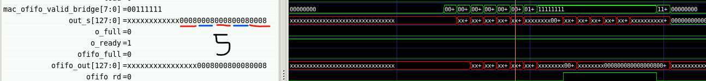
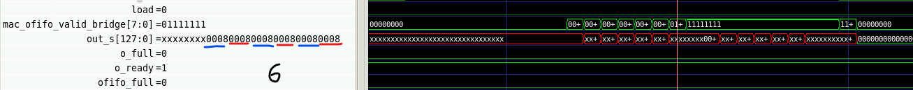
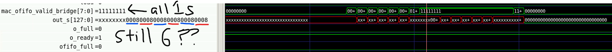

# mac_array problem:
* it seems like when the mac_array is active, the psum propagation stops at the 7th and 8th column (1 indexed).

* for out_s it stops at xxxx_xxxx_0008_0008_0008_0008_0008_0008

# also lowkey maybe the sfp isn't working as well.
* eventually for each of the 9 vectors from 3x3 kernel, if the weights are 0 then at that point ofifo out should be 0s and the sram_in and sram_outs would just be the 0008 stuff. 
* maybe checking the next depth of the ofifo? or maybe its related to the mac_array bug idk. 