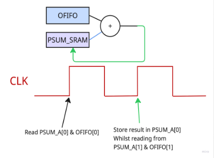

# ECE284 DNNs on 2D Systolic array with Optimizations 
### Contributors: MingWei Yeoh, Leo Naab, Karon Luo, Ian DeGrood, Jason Phung, Allen Keng

# Introduction
AI models, especially Deep Neural Networks (DNNs), need specialized hardware to run fast. The solution is custom AI accelerators built around two key ideas: SIMD and Systolic Arrays. Essentially, we will have our 2D systolic arrays made up of processing elements perform all the matrix multiplications we need. Input activations, weights, and partial sums will flow smoothly from one PE to the next. With our implementation, accelerators can reach better speeds and efficiency.   

# Part 1: Vanilla Version
* We trained a VGG16 Quantization Aware model with 4 bit activations and 4 bit weights to achieve 90.42% accuracy. 
  * Verified in [VGG16_Quantization_Vanilla_4bit.ipynb](./Part1/python/VGG16_Quantization_Vanilla_4bit.ipynb)

* Our hardware design (RTL) can be found in the [verilog](./Part1/verilog/) directory

* Our testbench can be found in [core_tb.v](./Part1/verilog/core_tb.v)

* Our FPGA Mapping Results are [here](./Part1/FPGA_SynthesisScreenshots.pdf) 

# Part 2: 2bit and 4bit Lane Reconfigurable SIMD Systolic Array
* We trained a VGG16 Quantization Aware model with 2 bit activations and 4 bit weights to achieve 90.32% accuracy. 
  * Verified in [proj_part2.ipynb](./Part2/python/proj_part2.ipynb)

* Our hardware design (RTL) can be found in the [verilog](./Part2/verilog/) directory.

* Our testbench can be found in [core_tb.v](./Part2/verilog/core_tb.v)

# Part 3: Weight Stationary and Output Stationary Reconfigurable Systolic Array (for only 4-bit MAC unit)
* Our hardware design (RTL) can be found in the [verilog](./Part3/verilog/) directory.

* Our testbench can be found in [core_tb.v](./Part3/verilog/core_tb.v)

# Alphas: Our Improvements :)
### Input Sparsity Controller:
* We use a sparsity controller to send a separate is_zero signal in our MAC tiles. 
* If a weight is 0, we turn off the MAC unit by keeping it's input ports constant. 
* Instead, for that MAC tile we will simply pass down the activations from west to east and the partial sum from north to south.
* We estimate about a 12.5% reduction in dynamic power consumption for a given MAC tile. 
* Found in the [Part4/Alpha1](./Part4/Alpha1/) directory

### Write-Buffered SRAM:
* Instead of having two SRAMs for simultaneous writing and reading, we have the write address delayed by one clock cycle to enable similar functionality using singular SRAM.

* This gives you all the efficiency benefits without the complexities of having two SRAMs when time to perform the accumulation step. 

### Leaky ReLu:
* We apply leaky ReLu activation function in the special function processor by performing a arithmetic right shift of 6 ( alpha = 0.015625) to negative input instead of outputting zeros. 

* This improves the flow of gradients during backpropagation and leads to more stable training.
  * We trained the model from Part1 that achieved 90.42% accuracy, except this time using LeakyReLu, and saw an improved accuracy of 91.37%. 
  * Additionally, it reached 90% accuracy in about 26 epochs rather than 40 epochs.
  * Jupyter Notebook found [here](./Part4/Alpha1+2/python/VGG16_Quantization_aware_train_leaky_relu.ipynb)

### Tiling: 
* 16x16 tiling allows us to perform the convolution stage on the model with less shrinking of the input and output dimensions. 
